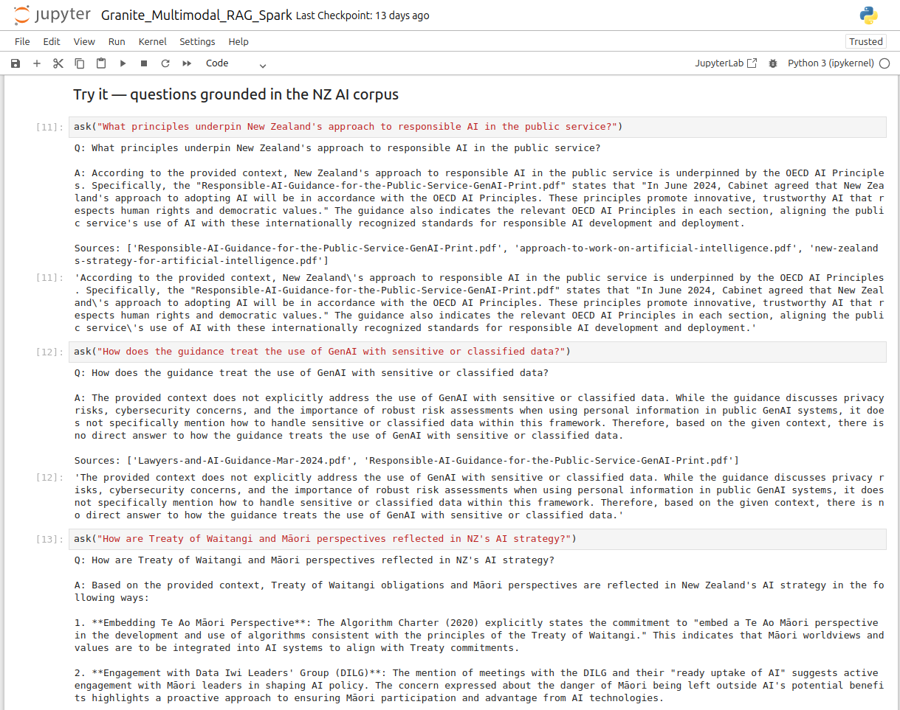
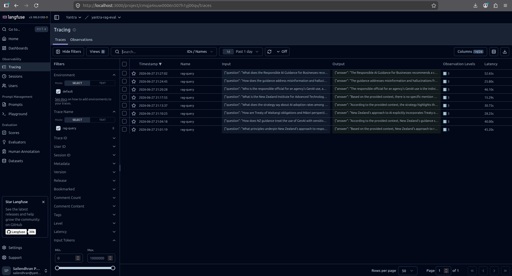
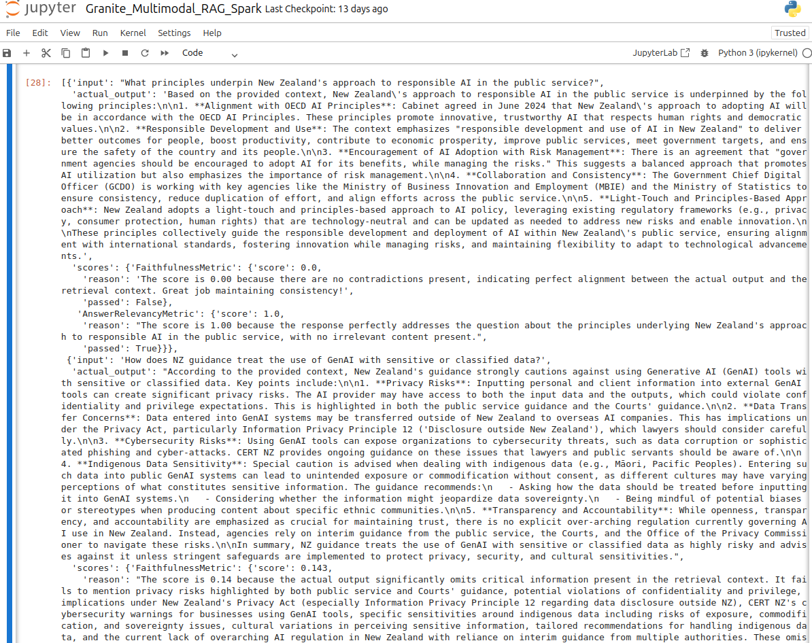
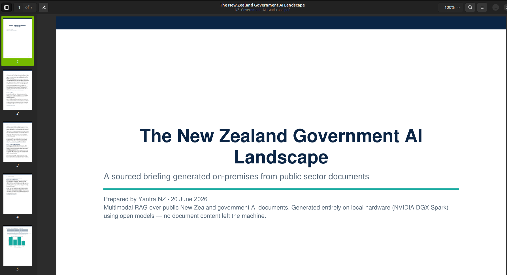
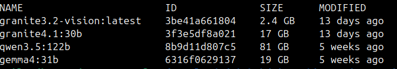

# On-Prem Multimodal RAG over the NZ Government AI Corpus

> A local, data-sovereign retrieval-augmented generation pipeline running entirely on an **NVIDIA DGX Spark (GB10)** — multimodal ingestion, IBM Granite models via Ollama, Langfuse tracing, and DeepEval evaluation. No cloud API; no document content leaves the machine.

Part of my [**AI Architect journey**](../) — this experiment builds a production-shaped RAG system end to end and adds the observability and evaluation layers that separate a prototype from something you could defend in a public-sector procurement.

---

## Why this exists

New Zealand public-sector buyers (Health NZ, Auckland Council, and similar) increasingly require **data residency** — sensitive documents cannot be sent to third-party cloud AI services. This experiment proves out a RAG stack that runs **fully on-premises** on a single GB10 desktop, over a corpus of real NZ government AI policy documents, while still offering the tracing and quality-evaluation tooling expected of a serious system.

It's both a technical proof and a reusable pattern: re-point the corpus and the same pipeline produces a grounded, auditable assistant over any document set.

---

## What it does

1. **Multimodal ingestion** — [Docling](https://github.com/DS4SD/docling) parses each PDF into text, tables, and images. A local Granite **vision** model captions the images (framework diagrams, OECD principle charts) so they become searchable too.
2. **Embedding + storage** — a Granite **multilingual embedding** model (chosen for te reo Māori coverage) vectorises everything into **ChromaDB**.
3. **Retrieval + generation** — relevant chunks are retrieved by semantic similarity and passed to a local Granite **30B** generation model, which answers grounded in that context only.
4. **Sourced PDF reports** — the pipeline can assemble a polished briefing: narrative grounded in retrieved passages, tables and charts built from figures *extracted* from the corpus (never invented), source figures, and a references section.
5. **Observability** — every query is traced in a self-hosted **Langfuse** dashboard (retrieval + generation spans, latency, token counts).
6. **Evaluation** — **DeepEval** scores answer quality (Faithfulness, Answer Relevancy) and retrieval quality (Contextual Recall/Precision) using the local Granite model as judge.

---

## Architecture

```
                         ┌──────────────────────────────────────────┐
                         │         NVIDIA DGX Spark (GB10)           │
                         │            128 GB unified memory          │
                         │                                           │
  NZ govt AI PDFs ──▶ Docling ──▶ [text │ tables │ images]           │
                         │                       │                   │
                         │              Granite vision (captions)    │
                         │                       │                   │
                         │            Granite multilingual embeddings│
                         │                       │                   │
                         │                   ChromaDB                 │
                         │                       │                   │
            query ─────▶ retrieval ──▶ Granite 4.1 30B (generation) ─┼──▶ answer
                         │                       │                   │
                         │     ┌─────────────────┴───────────────┐   │
                         │     ▼                                 ▼   │
                         │  Langfuse (tracing)        DeepEval (eval)│
                         │  self-hosted, local        local judge    │
                         └──────────────────────────────────────────┘

         All inference, tracing, and evaluation run on-device.
```

---

## Stack

| Layer | Technology |
|---|---|
| Hardware | NVIDIA DGX Spark (GB10 Grace-Blackwell, 128 GB unified memory, ARM64) |
| Model serving | [Ollama](https://ollama.com) |
| Generation | IBM Granite 4.1 30B |
| Vision | IBM Granite 3.2 Vision |
| Embeddings | `ibm-granite/granite-embedding-311m-multilingual-r2` |
| Doc parsing | Docling |
| Vector store | ChromaDB |
| Orchestration | LangChain |
| Observability | Langfuse (self-hosted, Docker) |
| Evaluation | DeepEval (local Ollama judge) |
| Reporting | ReportLab + matplotlib |

---

## Corpus

Real, public NZ government AI documents, including:

- **New Zealand's Strategy for Artificial Intelligence** — MBIE
- **Responsible AI Guidance for the Public Service: GenAI** — GCDO / digital.govt.nz
- **Responsible AI Guidance for Businesses** — MBIE
- **Algorithm Charter for Aotearoa New Zealand**
- Supporting cabinet papers and the Public Service AI Framework

> Documents are public but not redistributed here — a fetch script downloads them, or you drop the PDFs into `corpus/` manually.

---

## Screenshots

<!-- Replace the placeholders below with real screenshots once captured.
     Suggested: save images under docs/img/ and keep these filenames. -->

### RAG answering a grounded question
<!-- A notebook cell showing a question, the answer, and the cited sources. -->

RAG answering an NZ AI policy question with source attribution._

### Langfuse trace (retrieval + generation spans)
<!-- The Langfuse trace view for one query, expanded to show nested spans. -->

a `rag-query` trace showing nested retrieval and generation spans with latency and token counts._

### DeepEval scores
<!-- The eval summary output (Faithfulness / Answer Relevancy / Contextual metrics). -->

DeepEval metric scores across the golden question set._

### Generated PDF briefing
<!-- A page or two of the sourced PDF report (table + chart + references). -->

auto-generated, sourced PDF briefing with a data table and chart._

### DGX Spark / `ollama list`
<!-- Optional: terminal showing the models loaded locally on the Spark. -->

Granite models served locally via Ollama on the DGX Spark._

---

## Quick start

> Designed for the DGX Spark (DGX OS / Ubuntu ARM64). Adjust model tags to match `ollama list`.

```bash
# 1. One-time setup: installs Ollama, pulls Granite models, builds the venv, fetches the corpus
bash scripts/setup_spark.sh

# 2. Launch the notebook
source .venv/bin/activate
jupyter notebook Granite_Multimodal_RAG_Spark.ipynb
```

### Observability (Langfuse)

```bash
docker compose -f docker-compose.langfuse.yml up -d   # dashboard at http://localhost:3000
# create an account + project in the UI, copy the API keys
cp .env.example .env                                   # paste keys into .env
```

### Evaluation (DeepEval)

```bash
cp goldens.example.yaml goldens.yaml   # then fill in expected_output for retrieval metrics
```

Then run Steps 7 (tracing) and 8 (evaluation) in the notebook.

---

## How the pieces fit together

A clean iteration loop:

1. Run the **golden questions** through the pipeline.
2. **Langfuse** records exactly what each query did (which docs were retrieved, the prompt, latency).
3. **DeepEval** scores how good each answer was.
4. When a score is low, open the **Langfuse trace** to see *why* — was it retrieval (wrong chunks) or generation (right context, weak answer)?
5. Fix that stage, re-run the same goldens, and check whether scores improved.

**Trace to diagnose · eval to measure · goldens to keep it honest across changes.**

---

## What `goldens.yaml` is

A "golden" is a question paired with its known-correct answer (`expected_output`) — the fixed test set the pipeline is evaluated against. Reference-free metrics (Faithfulness, Answer Relevancy) run on the questions alone; filling in `expected_output` unlocks the retrieval metrics (Contextual Recall/Precision). A curated golden set turns evaluation into a **repeatable regression test** for answer quality: change the embedding model or chunk size, re-run, and see whether the numbers moved.

> The judge is itself an LLM, so treat scores as directional signal — which is exactly why a human-verified golden set matters. Version `goldens.yaml` alongside your model and corpus.

---

## Repository layout

```
.
├── Granite_Multimodal_RAG_Spark.ipynb   # the pipeline + report + tracing + eval
├── report_generator.py                  # sourced PDF briefing generator
├── traced_rag.py                        # RAG query path instrumented with Langfuse
├── evaluate.py                          # DeepEval evaluation (local Ollama judge)
├── goldens.example.yaml                 # golden-question scaffold (copy to goldens.yaml)
├── corpus_sources.py                    # manifest of NZ govt AI source documents
├── docker-compose.langfuse.yml          # self-hosted Langfuse stack
├── scripts/
│   ├── setup_spark.sh                   # one-shot Spark environment setup
│   └── fetch_corpus.py                  # downloads the corpus (manual fallback)
├── corpus/                              # PDFs live here
└── docs/img/                            # screenshots for this README
```

---

## Key learnings

- **Data sovereignty is a real differentiator**, not just a technical exercise — a fully on-prem RAG directly addresses NZ public-sector residency requirements.
- **The 128 GB unified memory** of the GB10 comfortably runs a 30B generation model and a vision model together — the whole point of the box.
- **A multilingual embedding model** materially improves retrieval of te reo Māori passages (Te Ao Māori, Treaty commitments) versus English-only embeddings.
- **Observability + evaluation are what make it credible.** "It answers questions" is a demo; "here are the traces and the faithfulness scores" is a system.
- **Grounding everything in sources** — and proving it via traces and extracted-only figures — is what makes the output auditable enough for government work.

---

## Notes & caveats

- Government CDNs may block automated downloads; if a corpus fetch fails, download the PDF in a browser and drop it into `corpus/`.
- The DGX Spark is ARM64 with compute capability `sm_121` (not a B200's `sm_100`) — use ARM64 + CUDA builds of dependencies.
- Langfuse v3 self-hosting runs several containers (Postgres, Clickhouse, Redis, MinIO, worker, web); all must be healthy before the dashboard comes up.

---

## License & attribution

Pipeline derived in part from the [IBM Granite Community multimodal RAG recipe](https://github.com/ibm-granite-community/granite-snack-cookbook) (Apache-2.0). Granite models © IBM. NZ government documents are Crown copyright, used under their respective terms; they are not redistributed in this repository.

---

*Built by [Yantra NZ](https://yantranz.com) · exploring data-sovereign AI for the New Zealand public sector.*
